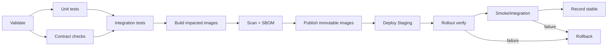

# NewA: инструкция по внедрению CI/CD

## 1. Назначение документа

Этот документ — техническое задание и пошаговая инструкция для агента, который
будет внедрять CI/CD проекта NewA.

На момент подготовки документа исходный код и инфраструктурные файлы NewA в
рабочей папке отсутствуют. Поэтому здесь зафиксированы:

- целевая архитектура;
- обязательные свойства решения;
- рекомендуемые исходные решения;
- порядок обследования реального проекта;
- этапы внедрения;
- критерии приёмки;
- процедуры deploy, проверки и rollback.

Агент не должен слепо создавать конфигурацию по примерам из этого документа.
Сначала он обязан обследовать фактическую структуру NewA и уточнить все
обозначенные здесь точки вариативности.

## 2. Цель

Изменение должно проходить воспроизводимый путь:

```text
feature branch
  → локальная проверка
  → Merge Request
  → обязательные CI-проверки
  → merge в main
  → сборка затронутых сервисов
  → публикация immutable-образов
  → deploy в Staging
  → автоматическая и ручная проверка
  → фиксация stable или rollback
```

Решение должно обеспечивать:

1. воспроизводимую сборку в чистом CI-окружении;
2. однозначную связь commit, pipeline, image и deployment;
3. отсутствие прямого доступа GitLab.com к Kubernetes API;
4. минимальные права CI и компонентов кластера;
5. обновление приложений без предварительной остановки исправных Pod;
6. проверяемый возврат к последней заведомо исправной версии;
7. защиту Staging от конкурирующих и устаревших deploy jobs;
8. возможность позднее добавить Production без пересборки образа.

## 3. Принятые базовые решения

Эти решения считаются исходными, пока обследование NewA не выявит
противопоказаний.

| Область | Базовое решение |
|---|---|
| Git-платформа | GitLab.com |
| Default branch | защищённая `main` |
| Git workflow | короткоживущие `feature/*`, `fix/*`, merge только через MR |
| Release artifact | OCI image в GitLab Container Registry |
| Версия image | immutable commit SHA и обязательная фиксация digest |
| Kubernetes | локальный/частный k3s |
| Связь GitLab с k3s | GitLab Agent for Kubernetes |
| Первая среда CD | `staging` |
| Namespace | отдельный `newa-staging` |
| Deploy-механизм | Helm как исходный вариант |
| Стратегия обновления | Kubernetes `RollingUpdate` |
| Доступ pipeline к кластеру | namespace-scoped RBAC, без `cluster-admin` |
| Конкурентные deploy | сериализация через `resource_group` |
| Быстрый rollback | Helm rollback или deploy last-known-good digest |
| Source-of-truth repair | Git revert/fix через MR после быстрого rollback |
| Production | вне первого этапа; проектировать promotion без rebuild |

Для Staging допустим push-based deploy из GitLab CI через Agent. Для будущей
Production следует отдельно сравнить этот способ с pull-based GitOps через Flux.

## 4. Термины и границы

- **Dev** — локальная среда разработчика.
- **CI** — validate, test, build, scan и публикация артефактов.
- **CD** — изменение желаемого состояния Staging и проверка результата.
- **Staging** — общая тестовая среда в k3s, а не Git-ветка.
- **Candidate** — прошедший CI набор образов, ещё не признанный стабильным.
- **Last known good** — последний deployment, успешно прошедший rollout и
  обязательные проверки Staging.
- **Rollback** — новый deployment ранее проверенной версии, а не удаление
  истории дефектного релиза.

Код пушится в GitLab repository. Формулировку «пушить код на Staging» в
документации и автоматизации не использовать.

## 5. Целевая архитектура

```mermaid
flowchart LR
    DEV["Разработчик"] -->|"push feature branch"| REPO["GitLab repository"]
    REPO --> MR["Merge Request"]
    MR --> CI["GitLab pipeline"]
    CI --> RUNNER["Runner"]
    RUNNER -->|"push image by SHA"| REG["GitLab Container Registry"]
    RUNNER -->|"deploy request"| KAS["GitLab KAS"]
    AGENT["agentk в k3s"] -->|"исходящее соединение"| KAS
    KAS --> AGENT
    AGENT --> API["Kubernetes API"]
    API --> NS["namespace newa-staging"]
    NS -->|"pull by digest"| REG
```



Границы ответственности:

- GitLab хранит repository, MR, pipeline, metadata deployment и registry;
- Runner исполняет CI jobs;
- GitLab Agent передаёт разрешённые запросы в закрытый кластер;
- Kubernetes controllers выполняют rollout и поддерживают желаемое состояние;
- приложение обслуживает трафик только после успешной readiness-проверки.

## 6. Обязательное обследование перед внедрением

Агент должен начать с read-only обследования и зафиксировать результат отдельным
разделом в документации NewA.

### 6.1. Repository

Определить:

- monorepo или отдельный repository для каждого сервиса;
- перечень микросервисов;
- расположение Dockerfile;
- используемые языки, package managers и lock-файлы;
- общие библиотеки;
- генераторы кода;
- существующие test-команды;
- существующие Compose, Helm, Kustomize и Kubernetes-файлы;
- наличие `.gitlab-ci.yml` и подключаемых CI templates;
- правила версионирования.

### 6.2. Граф зависимостей

Построить таблицу:

| Компонент | Собираемый image | Зависит от | Что требует его пересборки |
|---|---|---|---|
| Заполнить после обследования | | | |

Изменение общей библиотеки должно запускать сборку всех зависящих сервисов.
Одного `rules:changes` по каталогу сервиса для этого может быть недостаточно.

### 6.3. Runtime

Зафиксировать:

- версию k3s/Kubernetes;
- состав и ресурсы узлов;
- ingress controller;
- storage classes и persistent volumes;
- CNI и NetworkPolicy;
- DNS, TLS и внешние endpoints;
- ограничения выхода к `gitlab.com` и Registry;
- текущую систему логов, метрик и alerts;
- базы данных, брокеры и внешние системы.

### 6.4. Данные и совместимость

Для каждого stateful-компонента определить:

- как выполняются миграции;
- совместимы ли версии приложения N и N−1 с одной схемой БД;
- возможна ли параллельная работа двух версий;
- есть ли необратимые внешние эффекты;
- как создаются и проверяются backup;
- какие операции запрещают автоматический rollback.

### 6.5. Неопределённости, требующие решения владельца

Не продолжать опасную часть внедрения без решения по следующим вопросам:

- допустимый простой Staging;
- владелец deploy и rollback;
- обязательный набор бизнес smoke-тестов;
- политика Critical/High vulnerabilities;
- срок хранения образов;
- источник и способ ротации secrets;
- необходимость независимого релиза отдельных сервисов;
- требования будущей Production.

## 7. Git workflow

### 7.1. Ветки

- `main` — единственная долгоживущая ветка первого этапа;
- `feature/<issue>-<name>` — функциональные изменения;
- `fix/<issue>-<name>` — исправления;
- `hotfix/*` не должен обходить MR и CI;
- прямой push и force push в `main` запрещены.

### 7.2. Merge Request gates

Merge разрешается только при выполнении всех применимых условий:

- pipeline успешен;
- есть обязательное approval;
- нет unresolved discussions;
- отработали CODEOWNERS для критичных путей;
- ветка не имеет неразрешённых конфликтов;
- security findings либо устранены, либо имеют согласованное исключение с
  владельцем и сроком;
- миграция БД прошла отдельную проверку совместимости;
- изменение содержит необходимые тесты и release notes.

### 7.3. Pipeline sources

| Событие | Разрешённые действия |
|---|---|
| Push feature-ветки | быстрые validate/test, без cluster credentials |
| Merge Request | полный test/security gate, опционально review environment |
| Merge в `main` | build, scan, publish, deploy Staging |
| Manual rollback | deploy last known good, только уполномоченная роль |
| Protected SemVer tag | резерв для будущего promotion в Production |
| Schedule | тяжёлые scans и maintenance с отдельными правами |

`workflow:rules` должен исключать случайный запуск двух эквивалентных pipelines
для одного commit.

## 8. Локальная разработка

Локальный сценарий должен позволять разработчику поднять:

- изменённые сервисы;
- необходимые зависимости;
- БД и брокеры;
- тестовые данные;
- локальные substitutes внешних систем, если они предусмотрены.

Минимальная локальная проверка:

1. сборка изменённых компонентов;
2. unit tests;
3. targeted integration tests;
4. проверка запуска;
5. проверка изменённого пользовательского или API-сценария.

Локально собранные образы не публикуются как release artifacts. CI обязан
воспроизвести сборку из commit в чистой среде.

## 9. Логический CI pipeline



Рекомендуемые stages:

```text
validate
test
build
scan
publish
deploy
verify
rollback
```

Stage не должен препятствовать разумному DAG-параллелизму. Независимые
сервисы, линтеры и тесты следует запускать параллельно через `needs`.

### 9.1. Validate

Проверять:

- форматирование и линтеры;
- схемы конфигурации;
- Dockerfile;
- Helm chart через lint/template;
- Kubernetes manifests;
- отсутствие очевидных секретов;
- соответствие версий и lock-файлов.

### 9.2. Test

Разделить:

- быстрые unit tests;
- component tests;
- contract tests между сервисами;
- integration tests;
- тест миграции БД на временном экземпляре.

Test reports и coverage публиковать как job artifacts/reports. Cache использовать
только для ускорения; cache не является release artifact.

### 9.3. Build

Требования:

- сборка только затронутых сервисов и зависимых от них компонентов;
- чистое и изолированное окружение;
- pinned base images, где это практически возможно;
- отсутствие постоянных secrets внутри image layers;
- OCI labels с repository URL, commit SHA и pipeline ID;
- одинаковый Dockerfile для Staging и будущей Production;
- отказ от небезопасного доступа к host Docker socket без отдельного решения.

### 9.4. Scan и SBOM

Минимально:

- dependency scan;
- secret detection;
- container scan;
- SBOM для опубликованного image.

Порог блокировки и механизм временного исключения должны быть формализованы.
Исключение содержит owner, причину и дату истечения.

### 9.5. Publish

Публикация разрешена только после обязательных проверок. Для каждого image
сохранить:

```text
service
repository
commit SHA
pipeline ID
immutable tag
image digest
SBOM/provenance location
created timestamp
```

Пример:

```text
registry.gitlab.com/<group>/newa/orders:7f18c94a
registry.gitlab.com/<group>/newa/orders@sha256:<digest>
```

`latest`, branch slug и mutable SemVer alias могут быть дополнительными
указателями, но Kubernetes deployment должен использовать digest либо
гарантированно immutable tag.

## 10. Registry

Настроить:

- write credential только для publish job;
- pull-only credential для k3s;
- отдельные права для разработчика и automation;
- `imagePullSecret` в `newa-staging`;
- ротацию pull credential;
- retention policy;
- защиту last-known-good и активных release images от cleanup;
- документированное поведение при недоступности Registry.

Agent token, CI job token и registry pull credential — разные credentials и не
должны заменять друг друга.

## 11. GitLab Agent и RBAC

### 11.1. Сетевая модель

`agentk` устанавливает исходящее защищённое соединение с GitLab KAS. Не
публиковать Kubernetes API в интернет только ради CI/CD.

Проверить egress из k3s к:

- `kas.gitlab.com`;
- GitLab Container Registry;
- DNS и доверенным центрам сертификации.

### 11.2. Авторизация

- Agent регистрируется в определённом GitLab project.
- Доступ выдаётся только project/group, которым он действительно нужен.
- По возможности ограничить agent access environment `staging`.
- CI job выбирает конкретный kubecontext явно.
- Не полагаться на context, случайно выбранный по умолчанию.

### 11.3. Kubernetes RBAC

Создать отдельную identity/service account для deploy в `newa-staging`.

Разрешить только необходимые действия над:

- Deployments/StatefulSets, если применимо;
- Services;
- Ingress;
- ConfigMaps;
- ограниченным набором Secrets;
- Jobs для миграций;
- Helm release resources, если нужны.

Не выдавать `cluster-admin`. Cluster-scoped ресурсы устанавливать отдельным
административным процессом.

## 12. Deploy в Staging

Deploy job должен:

1. получить manifest набора service → image digest;
2. выбрать разрешённый agent context;
3. убедиться, что target namespace равен `newa-staging`;
4. выполнить Helm diff/template validation, если доступно;
5. выполнить upgrade;
6. дождаться Kubernetes rollout с timeout;
7. сохранить Helm/Kubernetes revision;
8. передать управление verify jobs.

Все deploy jobs Staging сериализовать одним:

```text
resource_group: newa-staging
```

Устаревший pipeline не должен затереть deployment более нового commit.

## 13. Rolling update

Не останавливать старые workload заранее. Для stateless Deployment использовать:

- `strategy.type: RollingUpdate`;
- `maxUnavailable: 0`, если это допускают ресурсы;
- ограниченный `maxSurge`;
- `startupProbe`;
- `readinessProbe`, отражающую способность принимать трафик;
- `livenessProbe`, не дублирующую readiness бездумно;
- `terminationGracePeriodSeconds`;
- graceful shutdown приложения;
- `progressDeadlineSeconds`;
- достаточное `revisionHistoryLimit` для оперативного rollback.

Отдельно проверить:

- выдерживает ли БД одновременную работу N и N−1;
- не дублируют ли workers обработку задания;
- совместимы ли сообщения брокера;
- не ломает ли новая версия старые API clients;
- достаточно ли ресурсов k3s для `maxSurge`.

Если параллельная работа версий невозможна, выбрать отдельную стратегию:
recreate с согласованным простоем, blue-green или контролируемое переключение
workers.

## 14. Verification

### 14.1. Техническая проверка

- rollout завершён до timeout;
- все требуемые replicas готовы;
- отсутствуют `ImagePullBackOff` и `CrashLoopBackOff`;
- Pods не перезапускаются циклически;
- endpoints опубликованы;
- ingress отвечает;
- миграционные Jobs завершились ожидаемо.

### 14.2. Проверка приложения

Автоматизировать как минимум:

- health endpoint;
- основной read-сценарий;
- основной write-сценарий с очисткой тестовых данных;
- авторизацию;
- один критичный межсервисный сценарий;
- публикацию и обработку сообщения, если есть broker;
- доступ к обязательной внешней зависимости через безопасный тест.

### 14.3. Наблюдаемость

Сравнить до и после deploy:

- error rate;
- latency;
- число рестартов;
- CPU/memory saturation;
- backlog очередей;
- ошибки БД;
- бизнес-сигналы, если определены.

### 14.4. Фиксация успеха

После успешной проверки сохранить запись:

```text
environment: staging
commit
pipeline
service image digests
chart/manifests revision
deployment revision
initiator
verification results
timestamp
```

Этот набор становится новым last known good.

## 15. Rollback

### 15.1. Когда rollback не нужен

Если cluster ещё не изменён, сначала применять retry:

- временная ошибка сети;
- временная недоступность Registry до deploy;
- сбой Runner;
- ошибка скачивания dependency при безопасной повторяемости.

### 15.2. Автоматический rollback

Допустимые сигналы:

- rollout timeout;
- новый Pod не проходит startup/readiness;
- `ImagePullBackOff`;
- `CrashLoopBackOff`;
- провал обязательных smoke-тестов;
- Helm upgrade завершился ошибкой после изменения release.

Автоматический rollback запрещён без специального runbook при:

- необратимой миграции БД;
- частично выполненных внешних транзакциях;
- изменении формата сообщений без обратной совместимости;
- компрометации image или credential;
- неизвестном состоянии данных.

### 15.3. Быстрый технический возврат

Предпочтительный порядок:

1. заблокировать новые deploy в environment;
2. определить last-known-good deployment;
3. вернуть согласованный набор image digests и конфигурации;
4. использовать Helm rollback, если Helm является владельцем release;
5. дождаться rollout;
6. повторить технические и smoke-проверки;
7. если rollback неуспешен, остановить автоматические попытки и открыть
   инцидент.

`kubectl rollout undo` применять только для простого Deployment, если это не
создаёт расхождение с Helm/Git source of truth.

### 15.4. Декларативное закрепление

После восстановления:

- создать fix или revert через MR;
- привести manifests/values к фактически стабильной версии;
- запустить новый pipeline;
- сохранить evidence и причину rollback;
- не считать инцидент закрытым до устранения расхождения source of truth.

### 15.5. Проверка rollback

Rollback считается успешным только после тех же обязательных health и
smoke-проверок, что и обычный deploy.

## 16. Миграции БД

Использовать expand/contract:

1. добавить обратно совместимую схему;
2. развернуть код, способный работать со старой и новой формой;
3. перенести/дозаполнить данные;
4. переключить чтение;
5. удалить старую структуру отдельным поздним релизом.

Не выполнять destructive migration автоматически вместе со стартом каждого Pod.
Миграция должна быть отдельной идемпотентной Job с логом, timeout и понятным
owner.

Перед deploy агент обязан ответить:

```text
Сможет ли last-known-good image работать с новой схемой?
```

Если ответ отрицательный, автоматический rollback приложения не разрешать.

## 17. Secrets

Требования:

- не хранить значения secrets в Git;
- использовать masked/protected/environment-scoped CI variables либо выбранный
  secrets manager;
- не передавать Staging credentials в untrusted MR pipelines;
- не печатать secrets в job logs;
- разделять build, deploy, agent и registry credentials;
- описать owner, scope, rotation и revoke для каждого credential;
- проверить поведение после ротации.

## 18. Рекомендуемая структура файлов

Фактические пути адаптировать к repository:

```text
NewA/
├─ .gitlab-ci.yml
├─ .gitlab/
│  └─ ci/
│     ├─ workflow.yml
│     ├─ validate.yml
│     ├─ test.yml
│     ├─ build.yml
│     ├─ security.yml
│     ├─ deploy-staging.yml
│     └─ rollback.yml
├─ deploy/
│  ├─ helm/
│  │  └─ newa/
│  └─ environments/
│     └─ staging/
├─ scripts/
│  ├─ detect-affected-components.*
│  ├─ verify-staging.*
│  └─ resolve-last-known-good.*
└─ docs/
   ├─ ci-cd-implementation-guide.md
   ├─ deployment-runbook.md
   ├─ rollback-runbook.md
   └─ architecture-decisions/
```

Не создавать большое число CI-файлов, если реальный pipeline остаётся
небольшим. Разделение вводить по ответственности, а не ради структуры.

## 19. Поэтапное внедрение

### Этап 0. Обследование и ADR

Результат:

- inventory сервисов;
- dependency graph;
- карта environments и credentials;
- ADR по runner;
- ADR по Helm/Kustomize/GitOps;
- решение по миграциям;
- перечень критериев Staging.

Критерий приёмки: для каждого сервиса известны build, test, image, runtime,
owner и rollback constraints.

### Этап 1. CI без publish

Внедрить validate и tests для feature/MR pipelines.

Критерий приёмки:

- pipeline воспроизводим;
- ошибки блокируют merge;
- MR pipeline не получает cluster credentials;
- reports доступны в GitLab.

### Этап 2. Immutable build и Registry

Внедрить build, scan, SBOM и publish после merge в `main`.

Критерий приёмки:

- image однозначно связан с commit;
- digest записан;
- секрет не попадает в layers/logs;
- cleanup не удаляет active/last-known-good images;
- k3s может выполнить pull.

### Этап 3. Подключение k3s

Установить GitLab Agent и минимальный RBAC.

Критерий приёмки:

- Kubernetes API не опубликован наружу;
- agent подключён исходящим каналом;
- CI имеет доступ только к `newa-staging`;
- отрицательный тест подтверждает запрет чужого namespace/cluster resource.

### Этап 4. Deploy Staging

Добавить сериализованный deploy по digest.

Критерий приёмки:

- старые Pods не останавливаются до readiness новых;
- pipeline ждёт rollout;
- новый deployment виден в GitLab;
- старый pipeline не может затереть новый.

### Этап 5. Verification

Добавить smoke/integration и observability checks.

Критерий приёмки:

- намеренно сломанный image не становится stable;
- результаты тестов сохранены;
- last-known-good обновляется только после verify.

### Этап 6. Rollback exercise

Провести контролируемый отказ:

- несуществующий image;
- readiness failure;
- application smoke failure.

Критерий приёмки:

- версия восстановлена в целевое время;
- rollback сам проверен;
- source of truth исправлен;
- evidence доступен другому участнику без устных пояснений.

### Этап 7. Усиление

Добавить:

- policy для vulnerabilities;
- подпись/provenance, если требуется;
- NetworkPolicy;
- rotation drills;
- alerts и deployment markers;
- backup/restore test;
- protected environment и manual approvals.

### Этап 8. Production design

До добавления Production отдельно решить:

- GitOps/Flux или pipeline-driven deploy;
- promotion того же digest без rebuild;
- approvals;
- canary/blue-green;
- SLO и automatic rollback signals;
- RTO/RPO;
- секреты и отдельный Agent/RBAC.

## 20. Definition of Done

Внедрение первого этапа завершено, когда:

- `main` защищена;
- merge возможен только после обязательного CI;
- затронутые сервисы определяются корректно;
- опубликованные images immutable и трассируются до commit;
- Staging deploy использует digest;
- GitLab Agent имеет минимальные права;
- Kubernetes API не опубликован в интернет ради pipeline;
- rollout использует readiness и ограниченный timeout;
- deploy jobs сериализованы;
- обязательные smoke-тесты автоматизированы;
- last-known-good определяется автоматически и однозначно;
- rollback возвращает сервис и затем проверяет его;
- миграции не делают возврат N−1 опасным без явного запрета;
- другой инженер может выполнить deploy и rollback по runbook;
- проведено и задокументировано rollback exercise.

## 21. Evidence, которое агент должен предоставить

После внедрения агент прикладывает:

- список изменённых файлов;
- схему фактического pipeline;
- результаты lint/test;
- ссылку/ID успешного pipeline;
- image tag и digest;
- GitLab deployment record;
- вывод rollout status;
- результаты smoke-тестов;
- RBAC negative test;
- результат контролируемого rollback;
- список оставшихся рисков и отложенных решений.

Секретные значения в evidence не включать.

## 22. Официальные источники

- [GitLab CI/CD с Kubernetes через Agent](https://docs.gitlab.com/user/clusters/agent/ci_cd_workflow/)
- [GitLab Agent for Kubernetes](https://docs.gitlab.com/user/clusters/agent/)
- [GitLab GitOps workflow](https://docs.gitlab.com/user/clusters/agent/gitops/)
- [GitLab Container Registry](https://docs.gitlab.com/user/packages/container_registry/)
- [GitLab environments и deployments](https://docs.gitlab.com/ci/environments/)
- [Kubernetes Deployments](https://kubernetes.io/docs/concepts/workloads/controllers/deployment/)
- [Kubernetes rolling update](https://kubernetes.io/docs/tasks/run-application/update-deployment-rolling/)

